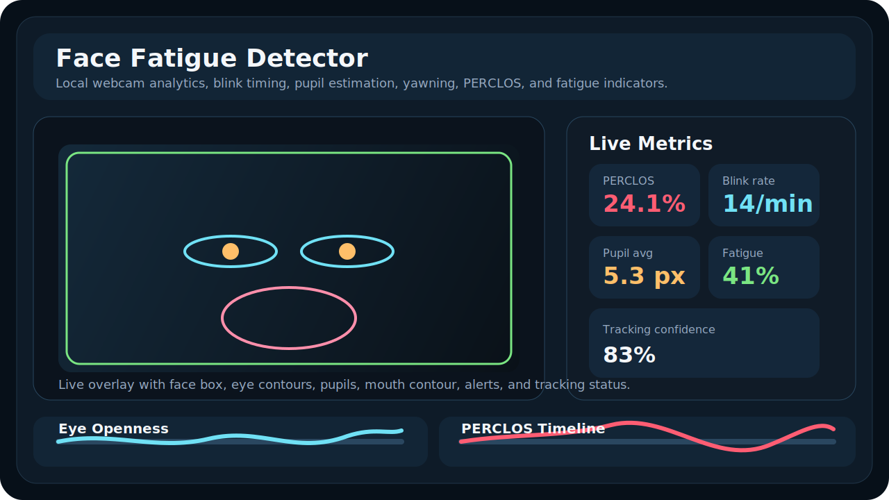
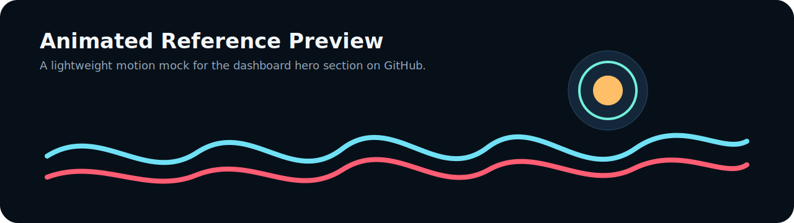
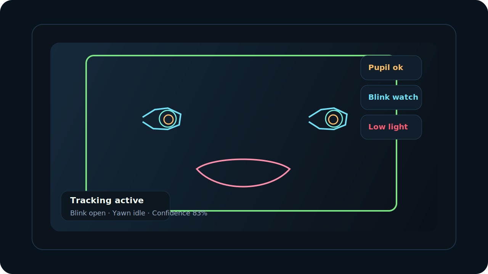
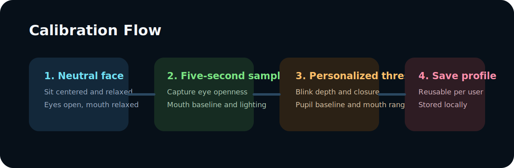
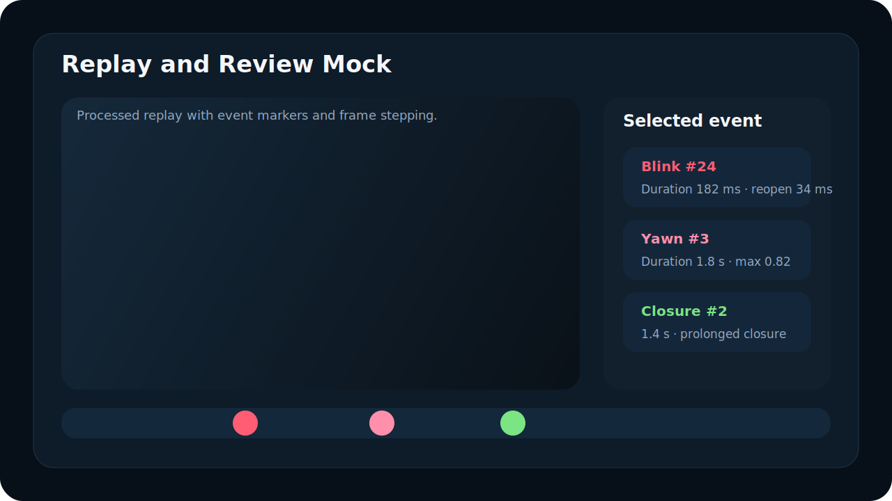
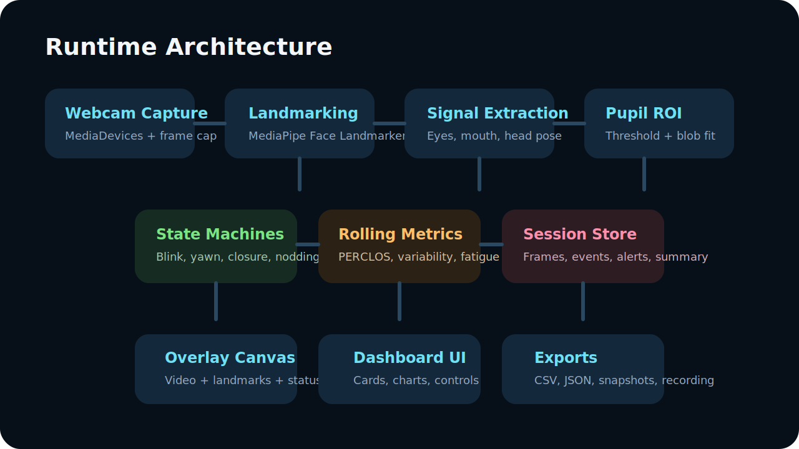

# Face Fatigue Detector

Privacy-first real-time webcam analysis for eye openness, blink dynamics, pupil diameter estimates, PERCLOS, yawning, head pose, and transparent fatigue-oriented indicators.

> Important: this is a research/demo prototype. It does **not** diagnose fatigue, drowsiness, or any medical condition.





## What this app does

- Captures live webcam video at `640x480` or `1280x720`
- Tracks the face with MediaPipe Face Landmarker
- Estimates left/right eye openness, eye closure percentage, mouth opening, and head pose
- Estimates pupil diameter inside eye ROIs with confidence gating
- Detects blinks with timing-aware state machines
- Computes blink duration, closing speed, reopening speed, reopening delay, and blink frequency
- Computes rolling `PERCLOS` for left eye, right eye, and combined eyes
- Detects yawns from sustained mouth opening
- Detects prolonged eye closure and microsleep-candidate events
- Adds a transparent, configurable, non-medical fatigue index
- Shows live overlays, rolling charts, alerts, event timeline, exports, and session summary
- Stores everything locally in the browser unless the user exports it

## UI gallery









## Architecture

The app is a browser-first local-processing prototype built with:

- `React + TypeScript + Vite`
- `MediaDevices API` for webcam access
- `@mediapipe/tasks-vision` for face landmarks
- Custom TypeScript modules for pupil estimation, blink/yawn/closure/nod state machines, rolling metrics, logging, and export

Pipeline summary:

1. Acquire webcam frames.
2. Run MediaPipe face landmark detection.
3. Extract eye, iris, mouth, and face geometry.
4. Estimate pupil diameter from dark-pixel segmentation inside the eye ROI.
5. Update blink, yawn, prolonged-closure, and head-nod state machines.
6. Update rolling PERCLOS, variability, and fatigue metrics.
7. Draw overlays and update the dashboard.
8. Log frame-level and event-level data.
9. Export CSV, JSON, snapshots, and overlay recordings.

More detail: [Architecture notes](docs/ARCHITECTURE.md)

## Project structure

```text
src/
  app/
  components/
  config/
  constants/
  demo/
  detection/
  events/
  hooks/
  metrics/
  storage/
  types/
  utils/
public/
  config.sample.json
docs/
  *.svg
```

## Setup

### 1. Install dependencies

```bash
npm install
```

### 2. Add the MediaPipe face model locally

Recommended local path:

```text
public/models/face_landmarker.task
```

The app validates that local file as a real MediaPipe task archive first. If it is missing or Vite serves an HTML fallback instead, the app automatically falls back to the hosted MediaPipe model URL.

### 3. Start the app

```bash
npm run dev
```

Open the local Vite URL in a Chromium-based browser, grant webcam permission, and press `Start webcam`.

### 4. Optional checks

```bash
npm run test
npm run build
```

## Configuration

- Default runtime settings live in [`src/config/defaultConfig.ts`](src/config/defaultConfig.ts)
- A portable sample config is included in [`public/config.sample.json`](public/config.sample.json)
- Camera settings, PERCLOS window, brightness/contrast compensation, and alert sound can be changed from the UI
- Calibration profiles are stored locally per browser profile via `localStorage`

## Detection logic

### Blink detection

- Uses eye closure percentage with hysteresis thresholds
- Blink start: closure rises above the open threshold
- Peak closure: maximum closure during the event
- Reopening start: closure falls by a minimum delta from the peak
- Blink end: closure returns below the open threshold

Formulas:

- `blink_duration = end_time - start_time`
- `closing_duration = peak_time - start_time`
- `reopening_duration = end_time - reopening_start_time`
- `reopening_delay = reopening_start_time - peak_time`
- `blink_speed = closure_depth / phase_duration`

### Pupil diameter

- Uses the landmarked eye ROI and iris center/diameter
- Samples grayscale pixels inside the iris neighborhood
- Adapts a dark-pixel threshold from the local intensity distribution
- Fits an equivalent circular diameter from the segmented dark region
- Rejects low-confidence points and keeps them out of raw summary stats

Outputs:

- left/right pupil diameter in pixels
- normalized pupil diameter relative to iris diameter
- confidence score
- rolling variability

### PERCLOS

- Uses a moving time window
- Counts the percentage of time that closure is above the configured threshold
- Tracks left, right, and combined eye closure separately

### Yawn detection

- Uses sustained mouth opening with temporal minimum duration
- Short openings are rejected as likely speech/random facial motion

## Exported data

Frame-level metrics include:

- timestamp, frame index, FPS
- face detection and tracking confidence
- left/right/combined eye openness
- left/right/combined closure percentage
- left/right pupil diameter and confidence
- mouth opening
- PERCLOS
- fatigue index
- head pose
- lighting and tracking quality

Event-level metrics include:

- blinks
- yawns
- prolonged closures
- microsleep candidates
- head nod events

Exports available from the UI:

- frame CSV
- event CSV
- session summary JSON
- PNG snapshot
- overlay recording (`WebM`, depending on browser codec support)

## Calibration and profiles

- 5-second neutral calibration mode
- Stores baseline eye openness, mouth opening, pupil diameter, and lighting
- Supports named local profiles
- Profiles can be reused across sessions to reduce threshold drift

## Privacy-first behavior

- Webcam permission is browser-controlled
- Processing is local in the client
- No cloud upload is required by default
- Recording/export is user-triggered only
- Session data can be cleared from the UI with one click

## What works reliably

- Face detection and tracking in ordinary indoor lighting
- Blink timing and blink frequency
- Eye openness and rolling PERCLOS
- Mouth-opening based yawn detection in frontal or near-frontal views
- Basic head pose estimates

## What is approximate

- Pupil diameter from standard RGB webcams
- Gaze instability and pupil-center offsets
- Head nod detection
- Composite fatigue index

## What needs calibration

- Baseline eye openness
- User-specific blink depth/open thresholds
- Mouth-opening range
- Pupil baseline

## What degrades under poor conditions

- Glasses reflections
- Low light or backlighting
- Motion blur
- Large head rotations
- Partial occlusion
- One eye temporarily leaving the frame

In low-confidence situations the app prefers to warn and suppress unreliable estimates rather than hallucinate stable values.

## Known limitations

- Pupil estimation is heuristic and strongly affected by lighting, reflections, image noise, and eye resolution
- The current implementation runs landmark inference on the main thread for simplicity; a worker-based version would improve responsiveness on slower machines
- Overlay recording is browser-codec dependent and is most reliable as `WebM`
- Replay tooling is represented in the UI/README design direction, but a full video review player is not yet implemented

## Recommended first run

1. Start the webcam.
2. Sit in even front lighting.
3. Run the 5-second calibration.
4. Check that both pupils show non-zero confidence.
5. Record a short session.
6. Export the frame CSV, event CSV, and summary JSON.

## Development notes

- `requirements.txt` is included only as a pointer because this project uses Node rather than Python
- The browser app exposes live frame metrics through a `BroadcastChannel` and `window` event for local integrations
- Demo mode is available for UI exploration without a webcam

## Media notes for GitHub

The repository already includes multiple SVG mockups for the README. After your first local run, you can add exported snapshots and WebM captures to `docs/` or `public/videos/` and embed them directly in this README for real session footage.
